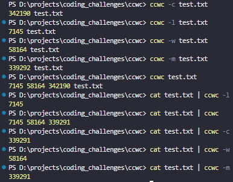
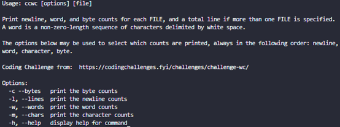

# My Own wc tool

My solution for `Build Your Own wc Tool` from https://codingchallenges.fyi/challenges/challenge-wc



## Usage



## How to run locally

```
npm run dev
ccwc [options] <file>
```

supports piping also

```
cat test.txt | ccwc -l
```
